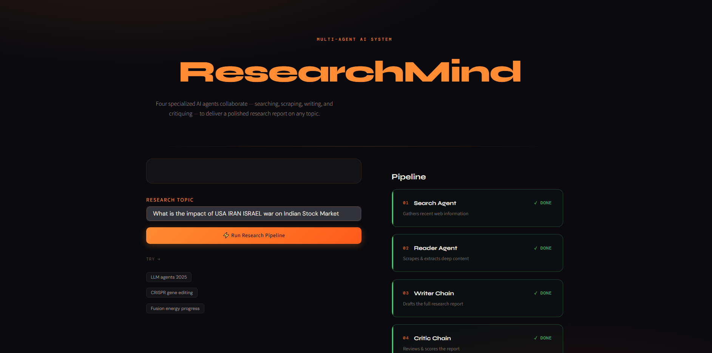

# 🔬 ResearchMind

**A multi-agent AI research assistant that searches, reads, writes, and critiques — autonomously.**

ResearchMind takes a single research topic and runs it through a pipeline of four specialized AI agents that collaborate to produce a polished, fact-checked research report. Instead of a single LLM answering from memory, a **Search Agent** goes out and finds live sources, a **Reader Agent** scrapes them for depth, a **Writer** drafts a structured report, and a **Critic** reviews it like a senior researcher grading a junior's work.

Built with **LangGraph**, **LangChain**, **Hugging Face**, **Tavily**, and **Streamlit**.

---



---

## ✨ Features

- 🔍 **Search Agent** — pulls recent, relevant sources from the live web via Tavily
- 📄 **Reader Agent** — scrapes and extracts clean text from the most relevant source
- ✍️ **Writer Chain** — synthesizes findings into a structured, professional report
- 🧐 **Critic Chain** — scores the report and gives specific, constructive feedback
- 🕸️ **True graph orchestration** — the whole pipeline is a LangGraph `StateGraph`, not a hardcoded script, so state flows between stages explicitly and the flow can branch or loop later
- 🎨 **Streamlit UI** — a live, styled dashboard showing each agent's progress in real time
- 💻 **CLI mode** — run the full pipeline from the terminal for quick testing/debugging

---

## 🏗️ Architecture

```
                 ┌───────────────┐
   topic  ──────▶│  Search Agent │  (web_search via Tavily)
                 └───────┬───────┘
                         │ search_results
                         ▼
                 ┌───────────────┐
                 │  Reader Agent │  (scrape_url via BeautifulSoup)
                 └───────┬───────┘
                         │ scraped_content
                         ▼
                 ┌───────────────┐
                 │  Writer Chain │  (LCEL: prompt → LLM → parser)
                 └───────┬───────┘
                         │ report
                         ▼
                 ┌───────────────┐
                 │  Critic Chain │  (LCEL: prompt → LLM → parser)
                 └───────┬───────┘
                         │ feedback
                         ▼
                 final report + critic feedback
```

Every node reads from and writes to a single shared `ResearchState`, defined and orchestrated in `graph.py` using LangGraph's `StateGraph`.

---

## 🧰 Tech Stack

| Layer | Tool |
|---|---|
| Agent orchestration | LangGraph (`StateGraph`) |
| Agent construction | LangChain (`create_agent`) |
| LLM | Meta Llama 3 8B Instruct via Hugging Face Inference Endpoint |
| Web search | Tavily API |
| Web scraping | Requests + BeautifulSoup |
| UI | Streamlit |
| Config | python-dotenv |

---

## 📁 Project Structure

```
research_system/
├── agents.py          # LLM setup + search/reader agents + writer/critic chains
├── graph.py            # LangGraph StateGraph wiring the full pipeline together
├── pipeline.py          # CLI runner — streams the graph, prints each stage
├── app.py              # Streamlit UI
├── tools.py             # web_search and scrape_url tool definitions
├── requirements.txt
├── .env                 # your API keys (not committed)
└── .gitignore
```

---

## ⚙️ Setup

### 1. Clone and enter the project folder
```bash
cd research_system
```

### 2. Create and activate a virtual environment

**Windows:**
```powershell
python -m venv venv
venv\Scripts\activate
```

**macOS / Linux:**
```bash
python3 -m venv venv
source venv/bin/activate
```

### 3. Install dependencies
```bash
pip install -r requirements.txt
```

### 4. Configure environment variables

Create a `.env` file in the project root:
```env
TAVILY_API_KEY=tvly-your-key-here
HUGGINGFACEHUB_API_TOKEN=hf-your-token-here
```

- Get a Tavily key: [tavily.com](https://tavily.com)
- Get a Hugging Face token: [huggingface.co/settings/tokens](https://huggingface.co/settings/tokens)
- Make sure HF account has accepted the license for `meta-llama/Meta-Llama-3-8B-Instruct` on its model page — gated models will 403 otherwise.

---

## ▶️ Usage

### Run from the CLI
```bash
python pipeline.py
```
You'll be prompted for a topic, and each stage's output prints as it completes.

### Run the Streamlit app
```bash
streamlit run app.py
```
Opens at `http://localhost:8501` — enter a topic, hit **Run Research Pipeline**, and watch the four agents work through the dashboard.

---

## 🩹 Troubleshooting

| Symptom | Likely cause | Fix |
|---|---|---|
| `ModuleNotFoundError` | Virtual env not activated, or install incomplete | Confirm `(venv)` shows in your prompt, then re-run `pip install -r requirements.txt` |
| `ImportError: cannot import name 'ExecutionInfo' from 'langgraph.runtime'` | `langchain` and `langgraph` versions are out of sync — this ecosystem moves fast and pinned versions can drift apart | Let pip's resolver pick mutually compatible versions instead of pinning both independently: `pip install -U langchain langgraph` in a clean venv, then re-freeze with `pip freeze > requirements.txt` |
| `401` / `403` from Hugging Face | Missing token or license not accepted for the Llama model | Check `.env`, and accept the model license on its Hugging Face page |
| Tavily errors | Missing/expired key, or free-tier quota hit | Check `TAVILY_API_KEY` and your usage dashboard on tavily.com |
| Deprecation warnings in console | `langgraph`/`langchain` API surface is still stabilizing post-1.0 | Safe to ignore unless it's a hard `ImportError` |
| Streamlit "port already in use" | Another app on 8501 | `streamlit run app.py --server.port 8502` |

---
